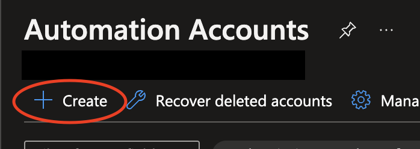
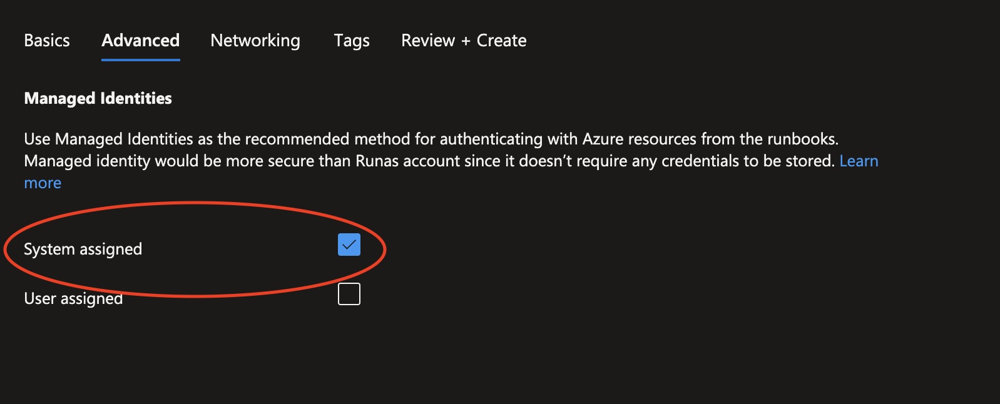
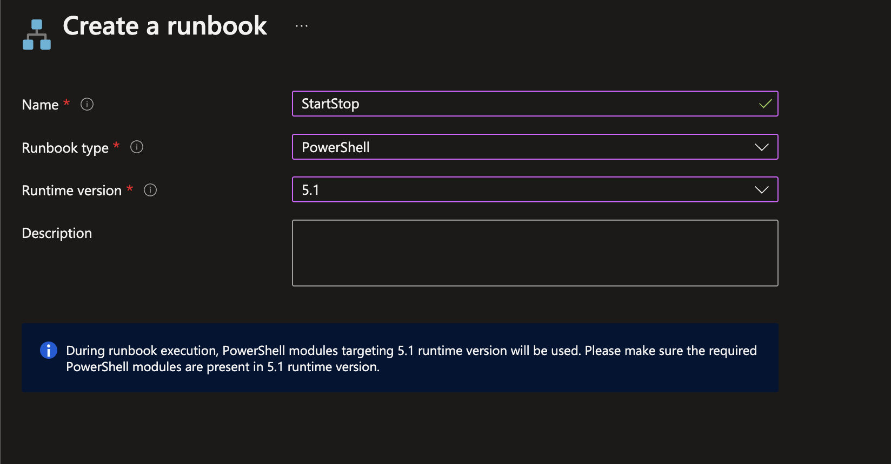
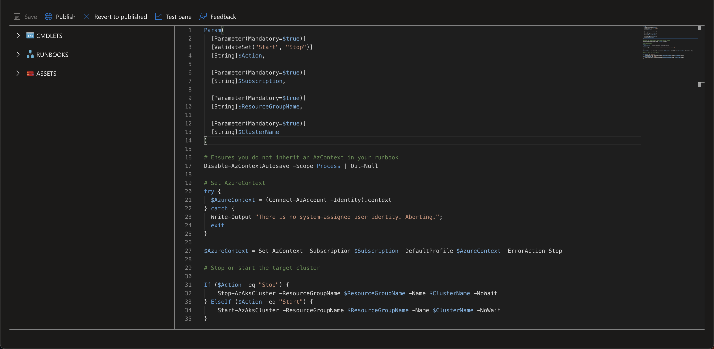
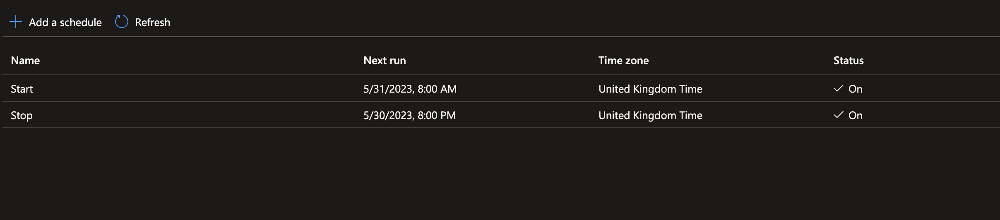
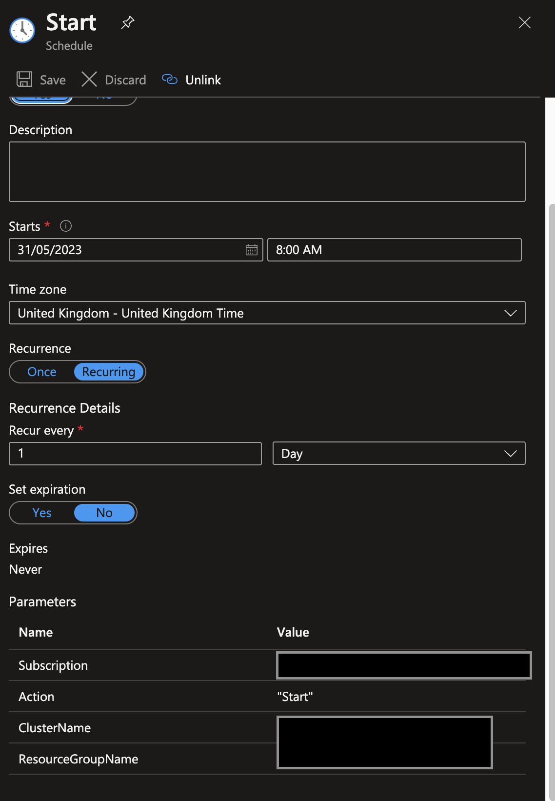

# Stop/Start AZ AKS Cluster

Azure automation account powershell runbook to start and stop AKS clusters on a schedule

## Setup
---

1. Login to the [azure portal](https://portal.azure.com)
2. Navigate to automation accounts
3. Select create

4. Make sure system assigned is ticked

5. Once create add a new runbook

6. Copy the contents of [runbook.ps1](./runbook.ps1) into the code editor

7. Setup schedules to start and stop your clusters

8. To start the cluster user `Start` and to stop use `Stop`.

9. Ensure the automation account managed identity has permission to manage cluster power
